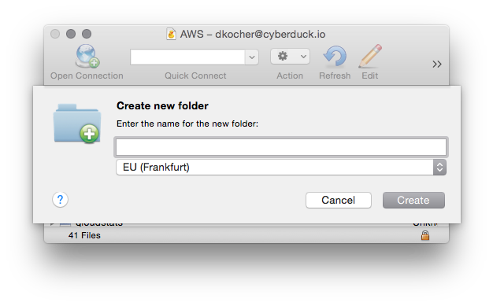
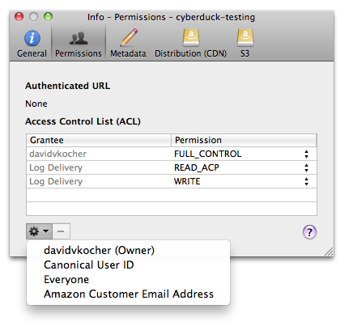

Amazon S3
===

Transfer files to your [S3](http://aws.amazon.com/s3) account and browse the S3 buckets and files in a hierarchical way. For a short overview of Amazon S3, refer to the [Wikipedia article](http://en.wikipedia.org/wiki/Amazon_S3).

# Connecting

You must obtain the login credentials (Access Key ID and Secret Access Key) of your [Amazon Web Services Account](http://aws.amazon.com/account/) from the [*AWS Access Identifiers page*](https://console.aws.amazon.com/iam/home?#security_credential). Enter the *Access Key ID* and *Secret Access Key* in the login prompt.

## IAM User

You can also connect using [IAM](IAM) credentials that have the `Amazon S3 Full Access` template policy permissions attached and optionally the `CloudFront Full Access`. Make sure you are connecting with `AWS4-HMAC-SHA256` signature version (see above).

## Generic S3 Profiles

For use with third party S3 installations.

`````{tabs}

````{tab} AWS4

**Authentication with signature version AWS4-HMAC-SHA256**

**HTTP**</br>
```{Important}
It is discouraged to enable this option to connect plaintext to Amazon S3.
```

If you have an S3 installation without SSL configured, you need an optional connection profile to connect using HTTP only without transport layer security. You will then have the added option S3 (HTTP) in the protocol dropdown selection in the [Connection](../../Cyberduck/Connection) and [Bookmark](../../Cyberduck/Bookmarks) panels.

* {download}`Download<https://svn.cyberduck.io/trunk/profiles/S3%20(HTTP).cyberduckprofile>` the *S3 (HTTP) profile* for preconfigured settings.

**HTTPS**</br>
- {download}`Download<https://svn.cyberduck.io/trunk/profiles/S3%20(HTTPS).cyberduckprofile>` the *S3 (HTTPS) profile* for preconfigured settings.
````

````{tab} AWS2

**Authentication with signature version AWS2**

An incomplete list of known providers that require the use of AWS2
- Riak Cloud Storage
- [EMC Elastic Cloud Storage](https://trac.cyberduck.io/wiki/help/en/howto/emc)

**HTTP**</br>
- {download}`Download<https://svn.cyberduck.io/trunk/profiles/S3%20AWS2%20Signature%20Version%20(HTTP).cyberduckprofile>` the S3 AWS2 Signature Version (HTTP) profile for preconfigured settings.

**HTTPS**</br>
- {download}`Download<https://svn.cyberduck.io/trunk/profiles/S3%20AWS2%20Signature%20Version%20(HTTPS).cyberduckprofile>` the S3 AWS2 Signature Version (HTTPS) profile for preconfigured settings.
````

`````

## AWS Gov Cloud

### S3 GovCloud (US-East)

Use the endpoint `s3-us-gov-east-1.amazonaws.com` or install the connection profile

- {download}`Download<https://svn.cyberduck.io/trunk/profiles/S3%20GovCloud%20(US-East).cyberduckprofile>` the *S3 GovCloud (US-East) profile* for preconfigured settings.

### S3 GovCloud (Us-West)

Use the endpoint `s3-us-gov-west-1.amazonaws.com` or install the connection profile

- {download}`Download<https://svn.cyberduck.io/trunk/profiles/S3%20GovCloud%20(US-East).cyberduckprofile>` the *S3 GovCloud (US-West) profile* for preconfigured settings.

## AWS China (Beijiing)

Connect to the region *AWS China (Beijing)*

- {download}`Download<https://svn.cyberduck.io/trunk/profiles/S3%20China%20(Beijing).cyberduckprofile>` the *S3 China (Beijing) profile* for preconfigured settings.

## Access Third Party Buckets

Connecting to a bucket you are not the owner (and therefore not included when logging in as above and listing all your owned buckets) is possible. You can access buckets owned by someone else if the ACL allows you to access it by either:

1. Specify the bucket you want to access in the hostname to connect to like `<bucketname>.s3.amazonaws.com`. Your own buckets will not be displayed but only the third-party bucket.
2. Set the *Default Path* in the bookmark to the bucket name.
3. Choose *Go → Go to Folder…* when already connected.

## Connecting with Temporary Access Credentials (Token) from EC2

If you are running Cyberduck for Windows or [Cyberduck CLI](https://duck.sh/) on EC2 and have setup [IAM Roles for Amazon EC2](http://docs.aws.amazon.com/AWSEC2/latest/UserGuide/iam-roles-for-amazon-ec2.html) to provide access to S3 from the EC2 instance, you can use the connection profile below that will fetch temporary credentials from EC2 instance metadata service at `http://169.254.169.254/latest/meta-data/iam/security-credentials/s3access` to authenticate. Edit the profile to change the role name `s3access` to match your IAM configuration.

- {download}`Download<https://svn.cyberduck.io/trunk/profiles/S3%20(Credentials%20from%20Instance%20Metadata).cyberduckprofile>` the *S3 (Credentials from Instance Metadata) profile* for preconfigured settings

## Connecting Using Credentials in `~/.aws/credentials`

Instead of providing Access Key ID and Secret Access Key, authenticate using credentials managed in `~/aws/credentials` using third-party tools.

- {download}`Download<https://svn.cyberduck.io/trunk/profiles/S3%20(Credentials%20from%20AWS%20Command%20Line%20Interface).cyberduckprofile>` the *S3 (Credentials from AWS Command Line Interface) profile* for preconfigured settings. 

You must provide configuration in the standard credentials property file `~/.aws/credentials` from [AWS Command Line Interface](https://docs.aws.amazon.com/cli/latest/userguide/cli-multiple-profiles.html). Configure a bookmark with the field titled *Profile Name in ~/.aws/credentials* matching the profile name from `~/.aws/credentials`. The properties `aws_access_key_id`, `aws_secret_access_key` and `aws_session_token` are supported.

You might be interested in scripts maintained by third parties to facilitate managing credentials

- [Manage configuration files for Cyberduck S3 (AssumeRoles from AWS STS)](https://github.com/jmvbxx/cyberduck-s3-config)
- [Utilities for easy management of AWS MFA and role sessions and virtual MFA devices](https://github.com/vwal/awscli-mfa)

## Connecting Using AssumeRole from AWS Security Token Service (STS)

Instead of providing Access Key ID and Secret Access Key, authenticate using temporary credentials from AWS Security Token Service (STS) with optional Multi-Factor Authentication (MFA). Refer to U[sing IAM Roles](https://docs.aws.amazon.com/IAM/latest/UserGuide/id_roles_use.html).


- {download}`Download<https://svn.cyberduck.io/trunk/profiles/S3%20(Credentials%20from%20AWS%20Security%20Token%20Service).cyberduckprofile>` the *S3 (Credentials from AWS Security Token Service) profile* for preconfigured settings.

You must provide configuration in the standard credentials property file `~/.aws/credentials` from [AWS Command Line Interface](https://docs.aws.amazon.com/cli/latest/userguide/cli-multiple-profiles.html). Configure a bookmark with the field titled *Profile Name* in `~/.aws/credentials` matching the profile name from `~/.aws/credentials` with the `role_arn` configuration.

### Example configuration

Refer to [Assuming a Role](https://docs.aws.amazon.com/cli/latest/userguide/cli-roles.html).

	[testuser]
	aws_access_key_id=<access key for testuser>
	aws_secret_access_key=<secret key for testuser>
	[testrole]
	role_arn=arn:aws:iam::123456789012:role/testrole
	source_profile=testuser
	mfa_serial=arn:aws:iam::123456789012:mfa/testuser

## Read Credentials from `~/.aws/credentials`

When editing a bookmark, the *Access Key ID* is set from the `default` profile in the credentials file located at `~/.aws/credentials` if such a profile exists.

# Cyberduck CLI

List all buckets with [Cyberduck CLI](https://duck.sh/) using

	duck --username <Access Key ID> --list s3:/

List the contents of a bucket with

	duck --username <Access Key ID>  --list s3:/<bucketname>/

Refer to the [Cyberduck CLI documentation](../../CLI/index) for more operations.

# Third Party Providers

There are a growing number of third parties besides Amazon offering S3 compatible cloud storage software or solutions. Here is a non-exhaustive list:

- [Aruba Cloud](https://www.cloud.it/)
- [Connectria Cloud Storage](https://www.mh.connectria.com/rp/order/cloud_storage_index)
- [DreamObjects Cloud Storage](DreamObjects)
- [Dunkel Cloud Storage](Dunkel)
- [Eucalyptus Walrus](Eucalyptus)
- [Google Storage](../Google_Cloud_Storage)
- [Outscale (using CEPH Opensource)](https://www.outscale.com/)
- [Scaleway](https://www.scaleway.com/docs/store-object-with-cyberduck/)
- [Scality (proprietary technology)](Scality)
- [Seeweb](https://www.seeweb.it/)
- [Exoscale Swiss Object Storage](Exoscale)
- [Verizon Cloud Storage](Verizon)
- [Spectra BlackPearl Deep Storage Gateway](Spectra)
- [MinIO Cloud Storage](MinIO)
- [Cynny Space](Cynny)
- [Cloudian HyperStore Appliance](https://cloudian.com/products/hyperstore/)
- [Swisscom S3 Dynamic Storage](https://www.swisscom.ch/en/business/enterprise/offer/cloud-data-center/dynamic-computing-services.html)
- [NetApp StorageGrid Webscale](https://docs.netapp.com/sgws-114/index.jsp)
- [Wasabi Storage](Wasabi)
- [DigitalOcean Spaces](DigitalOcean)
- [IBM Cloud Object Storage (COS)](IBM_COS)
- [Oracle Storage Cloud Service](Oracle_Cloud#OCIObjectStorage)
- [Alibaba Cloud Object Storage Service (OSS)](Alibaba)
- [Vultr Object Storage](https://www.vultr.com/docs/vultr-object-storage#Cyberduck_GUI_tool)
- [Linode Object Storage](https://www.linode.com/docs/platform/object-storage/how-to-use-object-storage/#cyberduck)
- [Filebase](Filebase)
- [Z1 Storage](Z1)
- [Pilvio](Pilvio)
- [IDrive® Cloud](IDrive_Cloud#S3)

# File System

## Buckets

### Creating a Bucket

o create a new [bucket](https://docs.aws.amazon.com/AmazonS3/latest/userguide/creating-bucket-s3.html) for your account, browse to the root and choose *File → New Folder... (macOS `⌘N` Windows `Ctrl+Shift+N`)*. You can choose the bucket location in *Preferences (macOS `⌘,` Windows `Ctrl+,`) → S3*. Note that Amazon has a different pricing scheme for different regions.

```{attention}
Mountain Duck 4.6.1 or later: You will receive a prompt for the region when creating a new bucket
```

**Supported Regions**
- EU (Ireland)
- EU (London)
- EU (Paris)
- EU (Stockholm)
- US East (Northern Virginia)
- US West (Northern California)
- US West (Oregon)
- Asia Pacific (Singapore)
- Asia Pacific (Tokyo)
- South America (São Paulo)
- Asia Pacific (Sydney)
- EU (Frankfurt)
- US East (Ohio)
- Asia Pacific (Seoul)
- Asia Pacific (Mumbai)
- Canada (Montreal)
- China (Beijing)
- China (Ningxia)



```{important}
- Because the bucket name must be globally unique the operation might fail if the name is already taken by someone else (E.g. don't assume any common name like *media* or *images* will be available).
- You cannot change the location of an existing bucket.
```

### Bucket Access Logging

When this option is enabled in the S3 panel of the Info (*File → Info (macOS `⌘I` Windows `Alt+Return`)*) window for a bucket or any file within, available log records for this bucket are periodically aggregated into log files and delivered to `/logs` in the target logging bucket specified. It is considered best practice to [choose a logging target](http://blog.qloudstat.com/2012/04/24/choose-a-logging-target/) that is different from the origin bucket.


To toggle CloudFront access logging, select the the [Distribution](../../CDN/CloudFront) panel in the File → Info (macOS `⌘I` Windows `Alt+Return`) window.

## Versions

## Folders

Creating a folder inside a bucket will create a placeholder object named after the directory, has no data content, and the MIME type application/x-directory.

### Supported Third Party Folder Placeholder Formats

- Folders created with [AWS Management Console](http://aws.amazon.com/console/).

## File Transfers

# Storage Class

You have the option to store files using the *Reduced Redundancy Storage (RRS)* by storing non-critical, reproducible data at lower levels of redundancy. Set the default storage class in *Preferences (macOS `⌘,` Windows `Ctrl+,`) → S3* and [edit the storage class](../../Cyberduck/Info#AmazonS3Panel) for already uploaded files using *File → Info (macOS `⌘I` Windows `Alt+Return`) → S3*. Available storage classes are

- Regular Amazon S3 Storage
- Intelligent-Tiering
- Standard IA (Infrequent Access)
- One Zone-Infrequent Access
- Reduced Redundancy Storage (RRS)
- Glacier
- Glacier Deep Archive

## Lifecycle Configuration

## Restore from Glacier

```{attention}
This function is Cyberduck only.
```

You can temporarily restore files from Glacier using *File → Restore*. The file will be restored using standard retrieval and expire 2 days after retrieval. Restoring takes some time and attempting to download an item not yet restored will lead to an error T*he operation is not valid for the object's storage class*.

### Glacier Retrieval Options

You can set retrieval options with the following [hidden configuration options](../../Cyberduck/Preferences#HiddenConfigurationOptions).

Sets Glacier retrieval tier at which the restore will be processed.

	s3.glacier.restore.tier=Standard

→ Valid values are `Standard`, `Bulk`, `Expedited`.

Sets the time, in days, between when an object is uploaded to the bucket and when it expires.

	s3.glacier.restore.expiration.days=2

# Access Control (ACL)

Amazon S3 uses Access Control List (ACL) settings to control who may access or modify items stored in S3. You can edit ACLs in *File → Info (macOS `⌘I` Windows `Alt+Return`) → Permissions*.



## Canonical User ID Grantee

If you enter a user ID unknown to AWS, the error message `S3 Error Message. Bad Request. Invalid id.` will be displayed.

## Email Address Grantee

If you enter an email address unknown to AWS, the error message `S3 Error Message. Bad Request. Invalid id.` will be displayed. If multiple accounts are registered with AWS for the given email address, the error message `Bad Request. The e-mail address you provided is associated with more than one account. Please retry your request using a different identification method or after resolving the ambiguity.` is returned.

## All Users Group Grantee

You must give the group grantee `http://acs.amazonaws.com/groups/global/AllUsers` read permissions for your objects to make them accessible using a regular web browser for everyone.

If [bucket logging](index#BucketAccessLogging) is enabled, the bucket ACL will have `READ_ACP` and `WRITE` permissions for the group grantee `http://acs.amazonaws.com/groups/s3/LogDelivery`.

## Default ACLs

You can set a [default ACL](https://docs.aws.amazon.com/AmazonS3/latest/userguide/acl-overview.html#canned-acl) set on new files uploaded and buckets created in *Preferences (macOS `⌘,` Windows `Ctrl+,`) → S3 → Default ACL*.

|  | Applies to buckets | Applies to files |
| --- | :---: | :---: |
| `private` | ✅ | ✅ |
| `public-read` | ✅ | ✅ |
| `public-read-write` | ✅ | ✅ |
| `authenticated-read` | ✅ | ✅ |
| `bucket-owner-read` | ❌	| ✅ |
| `bucket-owner-full-control` | ❌	| ✅ |

## Permissions

The following permissions can be given to grantees:

|  | Bucket | Files |
| --- | --- | --- |
| `READ` | Allows grantee to list the files in the bucket | Allows grantee to download the file and its metadata |
| `WRITE` | Allows grantee to create, overwrite, and delete any file in the bucket | Not applicable |
| `FULL_CONTROL` | Allows grantee all permissions on the bucket | Allows grantee all permissions on the object |
| `READ_ACP` | Allows grantee to read the bucket ACL | Allows grantee to read the file ACL |
| `WRITE_ACP` | Allows grantee to write the ACL for the applicable bucket | Allows grantee to write the ACL for the applicable file |

# Public URLs

# Metadata

# Server Side Encryption (SSE)

# CloudFront CDN

# Website Configuration

# Known Issues

# References