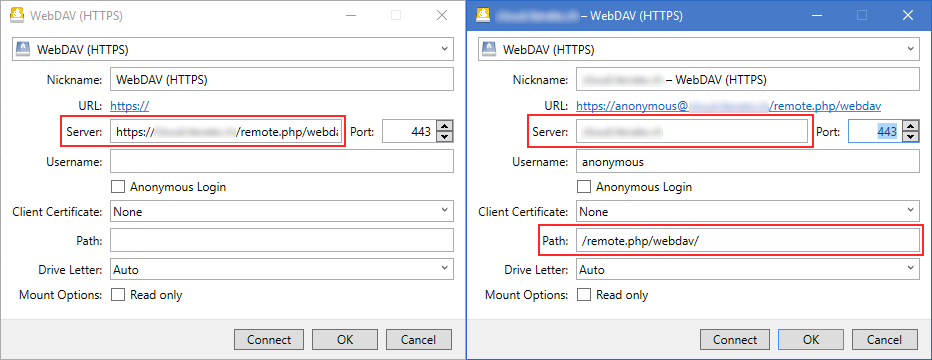

NextCloud & ownCloud
===

`````{tabs}

````{tab} Nextcloud

```{image} _images/logo_nextcloud.png
:alt: Nextcloud Logo
:height: 128px
```

> [Nextcloud Files](https://nextcloud.com/files/) is an on-premise, open-source file sync and share solution designed to be easy-to-use and highly secure.

````

````{tab} ownCloud

```{image} _images/owncloud-logo.png
:alt: ownCloud Logo
:height: 128px
```

> [ownCloud](https://owncloud.org/features/) is the most straightforward way to file sync and share data. You don’t need to worry about where or how to access your files. With ownCloud, all your data is where ever you are; accessible on all devices, any time.

````

`````

# Connecting

## Manual Configuration

Choose one of the protocols:

- Protocol: `WebDAV (HTTPS)`
- Default Path: `/remote.php/webdav/`

- Protocol: `Nextcloud & ownCloud`
- Default Path will be automatically be filled in

## Step-by-Step Instructions

1. Connect to your NextCloud or OwnCloud instance in your web browser and log in.
2. Click on the option Settings in the lower left of the screen and copy the displayed WebDAV address.
3. Create a new [bookmark](../../Cyberduck/Bookmarks.md):
In *Mountain Duck*, click on the icon in the tray area or status bar and choose the option *New Bookmark*.
In *Cyberduck*, click on *Bookmark* and choose the option *New Bookmark*.
4. Paste the previously copied WebDAV address into the Server field and press tab. After that, the bookmark will be set to *WebDAV (HTTPS)* and split the WebDAV address into two parts – the server address and the path.

5. Type your *Username* into the corresponding field and press *Connect* in the bookmark window if available or double click from the bookmark window.
6. Upon connecting, enter your password when requested in the login prompt.

## 2-Factor Authentication

With 2-factor authentication enabled, you will need to create an app password instead of your regular login credentials. You should find it in *Personal → App passwords*.

# Share Files

Create [public shares](../../Cyberduck/Share.md#nextcloud-and-owncloud) for people who are not Nextcloud/ownCloud users using *File → Share…*.

# Known Issues

## 0-Byte Files

If you are running an Apache configuration make sure to disable `fastcgi` and `php-fpm`. Refer to our [best practice for Nextcloud and ownCloud installations](../../Mountain_Duck/Issues_FastCGI.md).

## Slow Listings for Large Folder Structures

In order to retain timestamps for uploaded files, we make use of custom WebDAV properties. In Nextcloud and ownCloud these properties are stored in a dedicated database table `oc_properties`. This table unfortunately does not define any index to speed up the lookup for these properties when doing a listing. The database always has to do a full scan to find the properties for the requested resources. For installations with a large number of files, this can highly impact the response times for file listing. To overcome this issue you can create the following index:

	CREATE INDEX properties_path_index ON oc_properties(userid, propertypath)

Also, refer to the [issue](https://github.com/nextcloud/server/issues/8962) in GitHub.

# References

- [Accessing Nextcloud Files Using WebDAV](https://docs.nextcloud.com/server/13/user_manual/files/access_webdav.html)
- [Zero byte file truncate issue with Nextcloud and ownCloud deployed with FastCGI](../../Mountain_Duck/Issues_FastCGI.md)