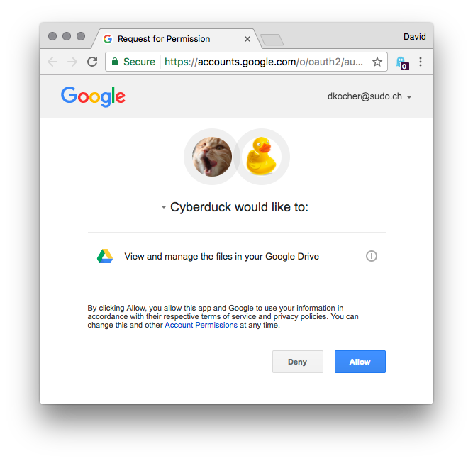
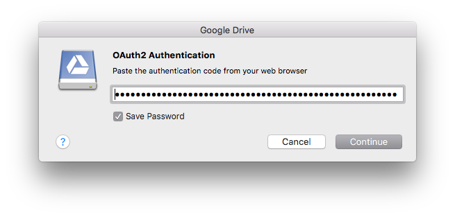

Google Drive
====

```{image} _images/googledrive.png
:alt: Google Drive Icon
:width: 128px
```

```{tip}
Download [Mountain Duck](https://mountainduck.io/) as an alternative to *Drive File Stream* or *Drive for Desktop*.
```

## Connecting

Connect to your [Google Drive](http://drive.google.com/) to store plain files.

### Authentication

Google Drive uses OAuth 2 to allow Cyberduck to access your files on Google Drive. Choose your account email as the username in the bookmark and choose *Allow* on the website opened in your default web browser to allow Cyberduck to *View and manage the files in your Google Drive*. Copy the authentication code displayed into the login prompt.





```{attention}
Using *[Advanced Protection Program](https://support.google.com/accounts/answer/7539956#non-goog_apps&zippy=%2Ccan-i-use-non-google-apps-services-or-apps-script-with-advanced-protection)* will cause the OAuth login flow to fail. 
```

### Google Apps Accounts

To access the Google Docs storage of your company's [Google Apps](https://workspace.google.com/features/) Account, use your email address connected to your Google Apps account for the username.

### Google Account With 2-Step Verification

Refer to [Signing in using application-specific passwords](http://support.google.com/accounts/bin/answer.py?answer=185833) on how to set an application-specific password to access Google Drive with 2-step verification enabled for your Google Account.

```{admonition} Multiple Accounts
:class: tip
You can connect to multiple accounts at the same time. Create a new bookmark for every account and run through the OAuth flow. Make sure to log out in your browser prior setting up a new bookmark to make sure the new bookmark is linked to a newly authenticated account.
```

### Reset OAuth Tokens

If you have accidentally logged in with the wrong Google Drive Account or want to change the login of the Google Drive bookmark delete the current bookmark and create a new one to start a new authentication flow.

Alternatively, you can reset the OAuth token by deleting the entries related to `duck:googledrive?user=(user)` out of the *Windows Credential Manager* or on macOS the entries related to `accounts.google.com` out of *Keychain*.

### Custom OAuth Client ID

You can register a [custom OAuth 2.0 client ID](profiles/google_client_id.md) with Google to operate independently of our registered client ID.

## Cyberduck CLI
You can list the root contents of your Google Drive with [Cyberduck CLI](https://duck.sh/) using

	duck --list googledrive:/

Refer to the [Cyberduck CLI](../cli/index.md) documentation for more operations. For subsequent invocations make sure to include the `--username` parameter and set it to the email address registered with Google to allow the lookup of previously saved OAuth tokens.

## Features
### Search

You can [search recursively](../cyberduck/browser.md#filter-and-search) for files fast without browsing folders first.

### Versions

A list of file versions can be viewed in the *Versions* tab of the *[Info](../cyberduck/info.md#versions)* window. Additionally, versions of the list can be deleted.

### Deleting Files and Folders

Deleted files are trashed instead of being permanently deleted. This feature is enabled by default. It can be disabled using a [hidden configuration option](../cyberduck/preferences.md#hidden-configuration-options).

	browser.delete.trash=false

### Documents

#### Google Docs Documents

For Google Docs documents (*Docs, Sheets, Slides*), URL shortcut files are displayed that point your web browser to the document in Google Docs.

- `.webloc` on macOS
- `.url` on Windows

```{attention}
*Google Docs* files can't be managed (renamed, moved, or deleted) within Mountain Duck or Cyberduck. 
```

#### Team Drives

Use the regular Google Drive connection type to see the *Team Drives* besides *My Drive* and *Shared with me*.

#### Shared with me

Documents shared with you from another Google account can be found inside the top-level folder *Shared with me*.

### Share

Create download [shares](../cyberduck/share.md#google-drive) of files or folders for others with no access to your Google Drive using *File → Share...*.

## Issues

### Rate Limits

Google Drive is imposing rate limits to requests resulting in `403 Forbidden` replies indicating the *Rate Limit Exceeded* error. Make sure you have set to *Repeat failed networking tasks* in [Preferences → Connection](../cyberduck/connection.md#repeat-failed-networking-tasks) and set a delay.

### Top Level folder
It is not possible to create a top level folder in Mountain Duck or Cyberduck. Instead, the following virtual top level folders are displayed which cannot be moved or renamed:

| Folder Name    |         Contents         |
|----------------|:------------------------:|
| My Drive       |      Personal files      |
| Shared Drives  |    Shared team drives    |
| Shared with me | Shared files and folders |

### The Granted Scopes do not Give Access to all of the Requested Spaces

Please remove the previously saved OAuth tokens `Google Drive (Email) OAuth2 Access Token` saved in your keychain and reconnect to grant Cyberduck access to Google Photos.

### Abusive Files

Google Drive may require the user is acknowledging the risk of downloading known malware or other abusive files. For such files a prompt *Acknowledge the risk of downloading known malware or other abusive file* is shown when the file has been flagged by Google as possible malware.
