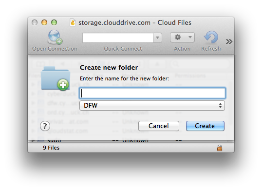

Swift (OpenStack Object Storage)
====

```{toctree}
:hidden:
:titlesonly:
auro
cloud.ca
cloud_a
cloudfiles
enter_cloud_suite
flexcloud
hubic
infomaniak
internap
memset
oktawave
ovh
selectel
swiftstack
zetta.io
```

```{image} _images/swift.png
:alt: Swift Drive Icon
:width: 128px
```

```{contents} Content
:depth: 2
:local:
```

## Connecting

Connect to a [Swift (OpenStack Object Storage)](https://docs.openstack.org/swift/latest/) installation. Choose *Swift (OpenStack Object Storage)* from the list of protocols.

```{Note}
All connection profiles are available through the *Preferences → Profiles* tab.
```

### Authentication Context Path

#### Authetication with `devauth` for Context `/v1.0`

Legacy authentication option.

- {download}`Download<https://svn.cyberduck.ch/trunk/profiles/Openstack%20Swift%20(v1).cyberduckprofile>` the *Openstack Swift (v1) profile* for preconfigured settings.

#### Authentication with `swauth`

Legacy authentication option.

- {download}`Download<http://profiles.cyberduck.io.s3.amazonaws.com/Openstack%20Swift%20(Swauth).cyberduckprofile>` the *Openstack Swift (Swauth HTTPS) profile* for preconfigured settings.
- {download}`Download<http://profiles.cyberduck.io.s3.amazonaws.com/Openstack%20Swift%20(Swauth%20HTTP).cyberduckprofile>` the *Openstack Swift (Swauth HTTP)* profile for preconfigured settings.

#### Authentication with `Keystone 2.0` for Context `/v2.0/tokens`

To get the login tokens from an OpenStack Identity service no configuration change is needed. You will get prompted to provide the tenant name with a *Provide additional login credentials* prompt or can provide it with the username in the format `<tenant>:<user>`.

Bundled by default since Cyberduck version 4.4.4.

- {download}`Download<http://profiles.cyberduck.io.s3.amazonaws.com/Openstack%20Swift%20(Keystone%202).cyberduckprofile>` the *Openstack Swift (Keystone 2) profile* for preconfigured settings.

If you have a Swift installation without SSL configured, you need an optional connection profile to connect using HTTP only without transport layer security.

- {download}`Download<http://profiles.cyberduck.io.s3.amazonaws.com/Openstack%20Swift%20(Keystone%202%20HTTP).cyberduckprofile>` the *Openstack Swift (Keystone 2 HTTP) profile* for preconfigured settings.

#### Authentication with `Keystone 3.0` for Context `/v3/tokens`

Bundled by default since Cyberduck version 4.8.

- {download}`Download<http://profiles.cyberduck.io.s3.amazonaws.com/Openstack%20Swift%20(Keystone%203).cyberduckprofile>` the *Openstack Swift (Keystone 3) profile* for preconfigured settings.

If you have a Swift installation without SSL configured, you need an optional connection profile to connect using HTTP only without transport layer security.

- {download}`Download<http://profiles.cyberduck.io.s3.amazonaws.com/Openstack%20Swift%20(Keystone%203%20HTTP).cyberduckprofile>` the *Openstack Swift (Keystone 3 HTTP) profile* for preconfigured settings.

You will get prompted to provide the project name with a *Provide additional login credentials prompt* or can provide it with the username in the format `<project>:<user>`.

### Regions

Multiple regions are supported when authenticating with a Keystone (2.0) identity endpoint. Containers from all regions are displayed in the browser. Choose *View → Column → Region* to display the region in the browser.

### Container

On your first login, you will need to create at least one container (folder) to put your content in. Choose *File → New Folder (MacOS `⌘N` Windows `Ctrl+N`)* and specify a name. After the container has been created, you may start adding your content to the storage platform.



## Cyberduck CLI

Connect with [Cyberduck CLI](https://duck.sh/) using the default connection profile using authentication with `Keystone 2.0` for context `/v2.0/tokens` with

	duck --username OS_TENANT_ID:OS_USERNAME --password PASSWORD  --list swift://SWIFT_KEYSTONE_AUTH_SERVER/CONTAINERNAME

Refer to the [Cyberduck CLI](../../cli/index.md) documentation for more operations.

## Third-Party Providers

- [Rackspace Cloud Files (US & UK)](cloudfiles.md) with [Akamai CDN](../../cdn/akamai.md)
- [Internap AgileFILES](internap.md)
- [Cloud.ca Object Store](cloud.ca.md)
- [Memset Memstore Object Storage](memset.md)
- [Enter Cloud Suite](enter_cloud_suite.md)
- [Oracle Storage Cloud Service](../s3/oracle_cloud.md#oci-object-storage-classic)
- [Oktawave Cloud Storage](oktawave.md)
- [SwiftStack](swiftstack.md)
- [RunAbove](https://runabove.readthedocs.io/en/latest/en/-posts/2014-04-22-how-to-use-cyberduck-with-openstack-swift/)
- [Cloud A](cloud_a.md)
- [AURO](auro.md)
- [OVH](ovh.md)
- [HubiC (OVH)](hubic.md)
- [Zetta.IO](zetta.io.md)
- [Selectel Cloud Storage](selectel.md)
- [Infomaniak](infomaniak.md)
- [IDrive® Cloud](../s3/idrive_cloud.md#openstack-swift) 
- [OpenStack FlexCloud](flexcloud.md)

## Temporary URLs

A private object stored in OpenStack Swift can be made publicly available for a limited time using a signed URL. The signed URL can be used by anyone to download the object, yet it includes a date and time after which the URL will no longer work. Copy the signed URL from *Edit → Copy URL→ Signed URL*.

- **Rackspace** A value must be set on your account metadata for `X-Account-Meta-Temp-Url-Key`.

## Large Uploads

Supported using Static Large Object segmentation. Files larger than 2GB are uploaded in segments using the default threshold. The upload chunk size is 100MB by default with a maximum of 5 concurrent connections. The number of connections used can be limited using the toggle in the lower right of the transfer window.

Large uploads can be resumed when interrupted.

## Distribution (CDN)

You can CDN enable the container using *File → Info → Distribution (CDN)* if supported by the provider.

## Preferences

### Large Upload Segment Size

You can set the [hidden option](../../cyberduck/preferences.md#hidden-configuration-options) `openstack.upload.largeobject.size` for the segment size in `bytes` (Issue [#9134](https://github.com/iterate-ch/cyberduck/issues/9134)).

## Known Issues

- <del>Authentication failure with ec2-credentials</del> (Issue [#7754](https://github.com/iterate-ch/cyberduck/issues/7754))

### Multiple OpenStack Swift Containers in Different Regions with the Same Name

Browsing containers will be erratic. As a workaround, browse a region by using a [connection profile](../profiles/index.md) limited to a single region as with [Rackspace Cloudfiles region profiles](cloudfiles.md#profile-for-a-single-region).

### In Finder.app, Creating a new top-level Folder in OpenStack Swift will not Allow to Rename it from `untitled folder`

<del>Because OpenStack Swift does not allow to rename containers this operation will fail.</del></br>As of Cyberduck version 2.2 the new bucket is created only after renaming in Finder. Make sure to choose a filename with no whitespace.