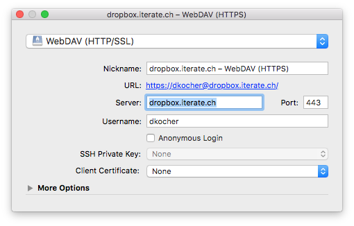

WebDAV
====

```{toctree}
:hidden:
:titlesonly:
bigcommerce
gmx
ikeepincloud
nextcloud
pcloud
seafile
```

You can connect to any WebDAV compliant server using both HTTP and HTTP/SSL. Mutual TLS with a client certificate for authentication is supported.

## Providers

Settings are specific to service providers. Use the provided [connection profiles](../index.md#connection-profiles).

```{Note}
All connection profiles are available through the *Preferences → Profiles* tab.
```

- [Nextcloud](nextcloud.md)
- [ownCloud](nextcloud.md)
- [GMX Mediacenter](gmx.md)
- [Box](../box.md)
- [BigCommerce](bigcommerce.md)
- [iKeepinCloud](ikeepincloud.md)
- [pCloud](pcloud.md)
- [Seafile](seafile.md)

## Supported Authentication Methods

### HTTP Basic Authentication

Basic Authentication should only be used when using a secured connection over TLS (HTTPS).

### HTTP Digest Authentication

Both *HTTP Basic Authentication* and *Digest Authentication* are supported.

### NTLM Authentication

Used when connecting to [SharePoint](../sharepoint.md) using WebDAV.

### Integrated Windows Authentication (IWA)

{download}`Download<https://github.com/iterate-ch/cyberduck/raw/master/profiles/WebDAV%20(Integrated%20Windows%20Authentication).cyberduckprofile>` and use the *WebDAV (Integrated Windows Authentication) profile* to connect to the server using *Integrated Windows Authentication*.

## SSL/TLS Support

Choose *WebDAV (HTTP/SSL)* as the connection protocol to secure the connection using SSL.

### Mutual TLS (mTLS)

Mutual (two-way) TLS with a client certificate for authentication is supported.

#### Prompt to Authenticate with Certificate When Negociating Secure (TLS) Connection

When a server requests a client certificate for authentication, a prompt is displayed to choose a certificate with a private key that matches the given issuer name requested from the server. Matching certificates are searched for in the *Keychain* on macOS or the *Windows Certificate Manager* respectively.


#### Select Client Certificate in Bookmark

You can also pre-select a certificate to use for authentication when editing the bookmark.



### Trust Certificate

If the certificate is not trusted by the system, you are asked to make an exception if you still want to connect to the site that cannot be verified. This failure during certificate trust verification is most often the case when the certificate is invalid either

- Because the hostname does not match the common name in the certificate. *You will get the error message You might be connecting to a server that is pretending to be…*.
- The certificate is self-signed or signed by a root authority not trusted in the system.
- The certificate is expired.

You can temporarily or permanently allow connecting nevertheless by choosing *Continue*. To remember your choice, select *Always Trust…*.

## Metadata

You can edit custom properties using File → Info → Metadata.

## Locks

````{tabs}

```{tab} Cyberduck

Files aren't locked when [editing](../../cyberduck/edit.md) with Cyberduck.

```

```{tab} Mountain Duck

Mountain Duck supports locking using `LOCK` and `UNLOCK` methods when opening documents for editing. Refer to [File Locking](../../mountainduck/locking).

```

````

## Distribution (CDN)

You can enable custom origin [Amazon CloudFront (Content Delivery Network) distribution](../../cdn/cloudfront.md) using *File → Info → Distribution (CDN)*.

### SharePoint

Refer to [SharePoint](../sharepoint.md) to connect using WebDAV.

### Subversion (SVN) Repositories

You can access publicly readable Subversion (SVN) repositories running behind `mod_dav_svn` of *Apache httpd* using anonymous WebDAV (HTTP) access with Cyberduck. For example the [Cyberduck Source Code Repository](http://svn.cyberduck.ch/trunk/).

## Known Issues

### Modification Date

Saving the modification dates requires support from server storing metadata in custom namespace.

### Cannot Login with Special Characters in Credentials

If your server requires the use of UTF-8 character set for authentication, set the [hidden configuration option](../../cyberduck/preferences.md#hidden-configuration-options)

	http.credentials.encoding=UTF-8

### Too Many Folders are Displayed

```{attention}
This only applies if you access a Synology Diskstation.
```

If the file listing shows additional folders of the file tree that are usually not visible try to uncheck the checkbox *disable directory browsing* within the advanced settings for a shared folder on your Synology Diskstation.

### Interoperability Failure `Handshake alert: unrecognized_name`

The virtual host set up by the hosting provider is most possibly misconfigured. It must accept TLS connections with SNI (Server Name Indication) extension (RFC 4366). The hostname must match the common name in the server certificate. In *Apache httpd* configurations, add a `ServerAlias` configuration directive with the hostname you use to connect.

You can verify the wrong server setup by running `openssl` with server name indication (SNI) enabled.

	openssl s_client -servername <servername> -tlsextdebug -msg -connect <servername>:443

This will print

	<<< TLS 1.0 Alert [length 0002], warning unrecognized_name

during the handshake, if there is a configuration problem.

See also Cyberduck Issue [#7908](https://github.com/iterate-ch/cyberduck/issues/7908).

### Disable Expect: 100-continue

The `Expect: 100-continue` to make sure a server accepts an upload before data is sent. You can disable the use of this feature when there is an interoperability issue by setting the [hidden option](../../cyberduck/preferences.md#hidden-configuration-options) `webdav.expect-continue` to `false`.

### Socket Timeout With GZIP Content Encoding

Some servers (cPanel) have invalid return GZIP encoded content. This error may not be seen with other clients that do not enable content compression. An invalid HTTP response status line is sent and the content size does not match the content length set. As a workaround, you can disable support for content compression. Set the [hidden option](../../cyberduck/preferences.md#hidden-configuration-options) `http.compression.enable` to `false`.

### Require Directive in Apache HTTPD

The `Require` directive in Apache HTTPD tests whether an authenticated user is authorized according to a particular authorization provider and the specified restrictions. You should configure it to return a 403 HTTP status code when authorization fails using the `AuthzSendForbiddenOnFailure` directive. Refer to [mod_authz_core](https://httpd.apache.org/docs/current/mod/mod_authz_core.html#authzsendforbiddenonfailure).

> If authentication succeeds but authorization fails, Apache HTTPD will respond with an HTTP response code of '401 UNAUTHORIZED' by default. This usually causes browsers to display the password dialogue to the user again, which is not wanted in all situations. AuthzSendForbiddenOnFailure allows changing the response code to '403 FORBIDDEN'.

### 0 Byte Files on WebDAV Server

If you are running an Apache configuration make sure to disable `fastcgi` and `php-fpm`. Refer to our [best practice for Nextcloud and ownCloud installations](../../mountainduck/issues/fastcgi.md).

### mod_evasive

Deployments with WebDAV on Apache HTTP server with the *mod_evasive* module may block requests leading to permission failures with `403` HTTP errors returned by the server.
